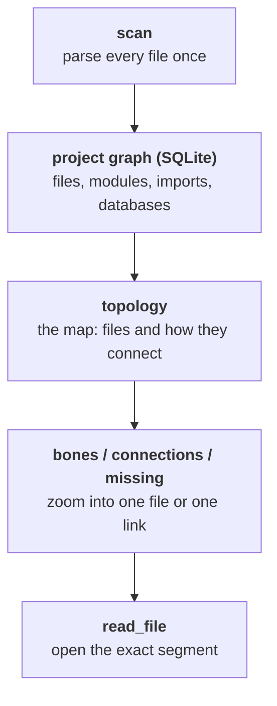
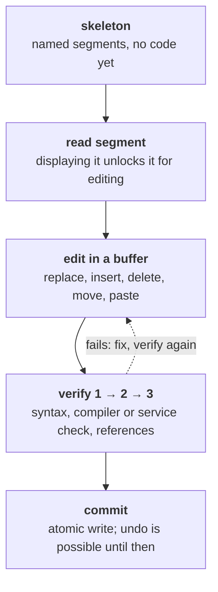
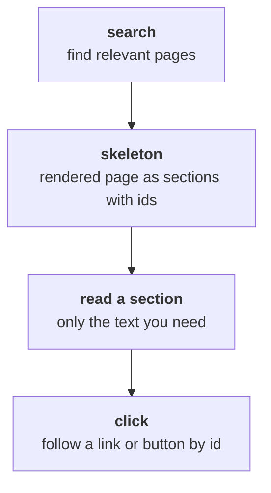
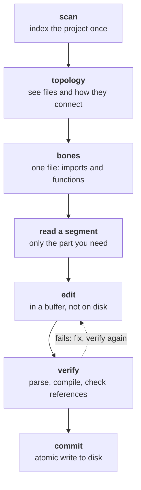
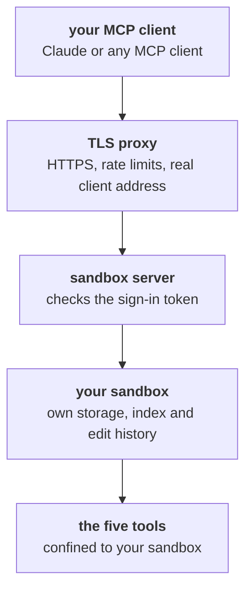
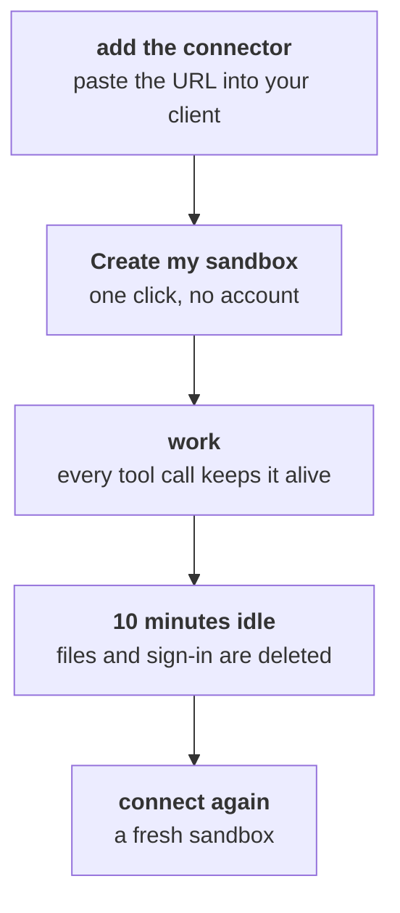

# Itamos MCP Tools

*Structured code perception for AI agents: how the tools work, why they are built this way, and how to try them in the free hosted sandbox.*

**Live alpha, free:** connect any MCP client to `https://mcp.itamos-technologia.com/mcp` (details at the end).

## Contents

- [The problem](#problem)
- [Design principles](#principles)
- [master_architect: the project map](#master-architect)
- [read_file: the segment editor](#read-file)
- [write_file: creating files](#write-file)
- [git: getting code in](#git)
- [web_skeleton: reading the web](#web-skeleton)
- [How the tools work together](#together)
- [The hosted sandbox](#sandbox)
- [Evidence so far](#evidence)
- [Limitations and roadmap](#limits)
- [License and contact](#license)
- [Try it](#try-it)

AI coding agents fail less from a lack of intelligence than from a lack of perception. They cannot see a codebase the way an engineer does, as a structure, so they search, open whole files and edit text they have only half read. The Itamos MCP tools give an agent that structure: a map of the project, named parts of every file, and a safe way to change them. This paper describes the five tools, the reasoning behind their design, and the free hosted sandbox where you can try them.

<a id="problem"></a>
## The problem

Codebases outgrow context windows. A mid-sized project has thousands of files, and a single file can run to thousands of lines. The usual workaround is text search plus whole-file reads, and it has four costs:

- **Tokens:** most of what the model reads has nothing to do with the task.
- **Blind edits:** the model changes code by matching text it has only partly seen.
- **Broken files:** an edit with a syntax error lands on disk, and the next step fails in confusing ways.
- **No map:** nothing tells the model how files connect, so cross-file bugs are found by luck.

<a id="principles"></a>
## Design principles

- **Structure before text.** The agent sees the map first, then zooms in.
- **Addresses, not line numbers.** Code is referred to by structural addresses that stay valid when other parts of the file change.
- **Read before write.** A tool will not change code the model has not displayed since the last change.
- **Verify before commit.** Edits stay in a buffer until they pass checks; only then do they reach disk.
- **One job per tool.** Small, predictable tools are easier for a model to use correctly than one tool that does everything.
- **The smallest useful answer.** Every response is the least text that answers the question, with a way to ask for more.

<a id="master-architect"></a>
## master_architect: the project map

master_architect scans a project and stores it as a graph in SQLite: every file, module, function and import, plus the databases, programs and servers the code refers to. Each item gets a hierarchical address such as `13.2.4`: file 13, module 2, method 4.


*master_architect turns a project into a map the agent can query.*

An agent starts with `topology`, which returns the project's files and how they import each other. `bones` zooms into one file: its imports and its functions, with addresses. `connections` follows the links into and out of a file, and `missing` lists imports that point at nothing.

### Why it is built this way

- **SQLite** keeps the graph self-contained: no database server, and it handles graphs with hundreds of thousands of items.
- **Hierarchical addresses** are short enough to pass between tool calls and stay valid when lines move.
- **Import resolution follows real project layouts:** packages, plain sibling imports in script folders, and `src/` layouts. An import that resolves to a project file is internal. One that is rooted in a project package but resolves to nothing is reported as broken, instead of being mistaken for an external library.

### Benefits

- Orientation in one call instead of dozens of searches.
- Cross-file bugs can be traced from where the error appears to where the logic went wrong.
- Broken imports are found before anything runs.

<a id="read-file"></a>
## read_file: the segment editor

read_file parses a file with tree-sitter into named segments: functions, classes, configuration blocks. By default it returns the skeleton, the list of segments with their names and sizes, not the code. The agent then reads only the segment it needs. For very large files, `search` narrows the skeleton to the matching segments.


*read_file: nothing reaches disk until it passes verification.*

Edits happen in a buffer: replace, insert, delete, move, comment out, or paste from another file. A segment must have been read since the last change before it can be modified. Verification then runs at up to three levels:

- **Level 1, syntax:** the buffer must parse.
- **Level 2, compiler or service check:** the language's own compiler or, for configuration files, the service's own checker, such as `nginx -t`, `systemd-analyze verify` or `sshd -t`.
- **Level 3, references:** imports and external references must resolve.

Only a verified buffer can be committed. The commit is atomic, writes through symlinks to the real file and keeps its permissions. Until then, every change can be undone.

### Why it is built this way

- **Segments instead of lines:** a function named `authenticate_user` stays addressable when it moves from line 214 to line 389.
- **Read before write** stops the most common agent mistake: editing code it never looked at.
- **Verify before commit** turns a broken edit into a clear error message instead of a broken file.

### Benefits

- In typical use the agent reads about 120 lines instead of a whole 5,000-line file.
- Broken edits never reach disk.
- Structural edits, like moving a function, keep the file valid.

<a id="write-file"></a>
## write_file: creating files

write_file creates new files and adds them to the project map. It refuses to overwrite an existing file: changes to existing files go through read_file, with its read-before-write and verification rules.

**Why:** silent overwrites are one of the most common ways agents destroy work. Making creating and editing two separate tools removes that ambiguity entirely.

<a id="git"></a>
## git: getting code in

The sandboxed git tool offers three operations: `clone` (remote URLs only, shallow), `status` and `commit`. Everything stays inside your sandbox. `push` is deliberately not available.

**Why:** a shallow clone turns minutes into seconds for large repositories, and most tasks need no history. Refusing local paths and push means the sandbox can neither read the host machine nor publish anywhere.

<a id="web-skeleton"></a>
## web_skeleton: reading the web

web_skeleton renders a page in headless Chromium, so content built by JavaScript is included, then reduces it to a skeleton: headings, sections, links and form elements, each with a stable id. The agent reads only the section it needs, or clicks an element by its id.


*web_skeleton: read the part of a page you need, not the whole page.*

**Why:** raw HTML is mostly layout, scripts and tracking. In typical use, a page that would cost 50,000 to 200,000 tokens as raw HTML becomes a skeleton of 500 to 3,000 tokens. In the public sandbox it only reaches public internet addresses, never private networks.

<a id="together"></a>
## How the tools work together


*The working loop: locate, read, change, verify, commit.*

A typical bug fix: the agent scans the repository, uses `topology` and `bones` to find the function named in the error, reads that one segment, replaces it, verifies and commits. If verification fails, it gets the exact error and tries again; the broken version never touches disk. When the cause sits in a different file from where the error appears, `connections` leads from the symptom to the cause.

<a id="sandbox"></a>
## The hosted sandbox


*The hosted sandbox: every request is tied to one private sandbox.*

The public sandbox runs the same five tools with firm limits around them:

- **Anonymous sign-in.** Hosted MCP clients such as claude.ai call from shared, rotating server addresses, so an IP address cannot tell users apart. Instead, each user gets a private sandbox through a standard OAuth flow whose sign-in page has a single button: no account and no email.
- **Isolation.** Each sandbox has its own storage volume (2 GB), its own project index and its own edit history. Every path is confined to the sandbox.
- **One per network.** During the alpha there is one sandbox per internet connection. If a connection drops, reconnecting from the same browser resumes the same sandbox, files included.
- **Ten minutes.** After 10 minutes without activity, the sandbox, its files and its sign-in are deleted. The next connection starts fresh.
- **500 at a time.** Up to 500 sandboxes run in parallel. When all are in use, new connections get "Try again later: we are currently at full capacity."


*A sandbox lives while you use it.*

> **This is a demonstration service.** Don't put anything sensitive or confidential in the sandbox. It is built for trying the tools, not for private data.

<a id="evidence"></a>
## Evidence so far

- In live use with Claude models (Opus and Sonnet), agents use the tools to navigate and change real codebases end to end.
- Locally run open models of 27 to 31 billion parameters showed the other side: they found the right file and function in an unfamiliar codebase, but did not complete the fix without guidance. Good tools help; model capability still matters.
- Benchmarks on real, open GitHub issues are in progress and will be published with full transcripts, time and token counts.

<a id="limits"></a>
## Limitations and roadmap

- **Alpha:** behavior and limits may change.
- **Temporary by design:** sandboxes are deleted after 10 minutes of inactivity.
- **No push:** results stay inside the sandbox.
- **Planned:** a waiting queue when all spots are taken, anonymous usage statistics, and the published benchmark set.

<a id="license"></a>
## License and contact

Free for personal use and open-source projects. Commercial use requires a licence: contact [info@itamos-technologia.com](mailto:info@itamos-technologia.com). Built by Itamos Technologia, a one-person company in Pili, Trikala, Greece.

<a id="try-it"></a>
## Try it

You have read how it works. Add this URL as a custom connector in your MCP client:

```
https://mcp.itamos-technologia.com/mcp
```

1. Add the URL as a connector in your MCP client.
2. A page opens: choose **Create my sandbox**. No account needed.
3. Ask your agent to clone a repository and explore it with the tools.

---

*This file is generated by `docs/build_paper.py`; edit the content there.*
