# Itamos MCP Tools

*Four tools, plus a sandboxed git, that let an AI agent see and change code the way an engineer does: a map of the project, named parts of every file, and checks before anything is saved. Try them free in a private sandbox, with no account and nothing to install.*

**Live alpha, free:** connect any MCP client to `https://mcp.itamos-technologia.com/mcp` (details at the end).

## Contents

- [Overview](#overview)
- [Sandbox server](#mcp-server)
- [Your private sandbox](#mcp-sandbox)
- [master_architect](#mcp-tool-master-architect)
- [read_file](#mcp-tool-read-file)
- [write_file](#mcp-tool-write-file)
- [git](#mcp-tool-git)
- [web_skeleton](#mcp-tool-web-skeleton)
- [Try it](#try-it)

<a id="overview"></a>
## Overview

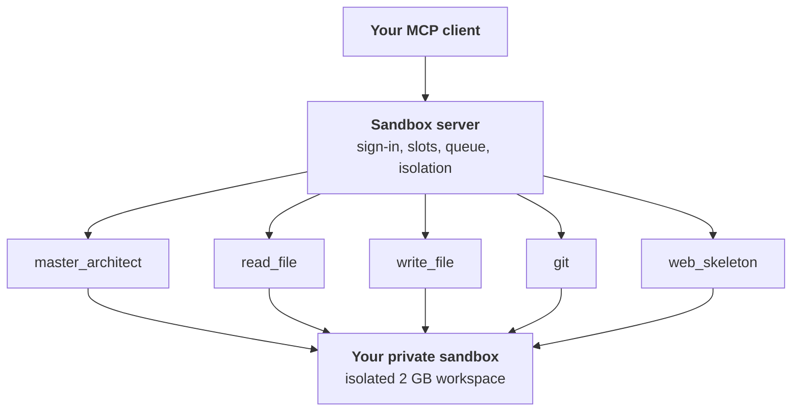

Select any part of the diagram for its own page: how it works, which components it depends on and everything it can do.

### The problem

AI coding agents fail less from a lack of intelligence than from a lack of perception. Codebases outgrow context windows, so agents search, open whole files and edit text they have only half read. That costs tokens, causes blind edits and broken files, and leaves the agent without a map of how files connect.

### Design principles

- **Structure before text.** The agent sees the map first, then zooms in.
- **Addresses, not line numbers.** Code is referred to by structural addresses that stay valid when other parts of the file change.
- **Read before write.** A tool will not change code the model has not displayed since the last change.
- **Verify before commit.** Edits stay in a buffer until they pass checks; only then do they reach disk.
- **One job per tool.** Small, predictable tools are easier for a model to use correctly than one tool that does everything.
- **The smallest useful answer.** Every response is the least text that answers the question, with a way to ask for more.

### How the tools work together

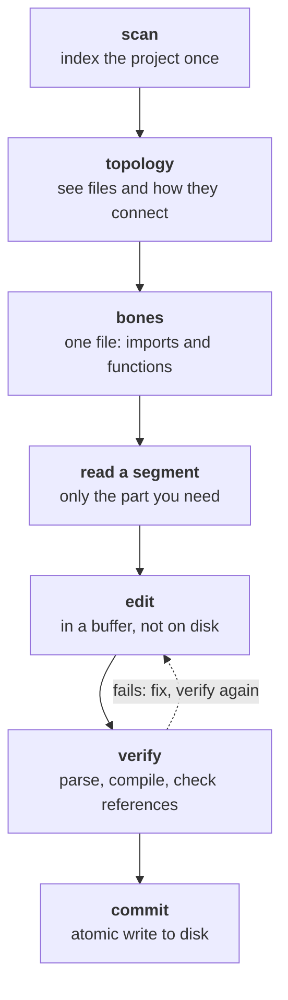
*The working loop: locate, read, change, verify, commit.*

A typical bug fix: the agent scans the repository, uses `topology` and `bones` to find the function named in the error, reads that one segment, replaces it, verifies and commits. If verification fails, it gets the exact error and tries again; the broken version never touches disk.

### Evidence so far

- In live use with Claude models (Opus and Sonnet), agents use the tools to navigate and change real codebases end to end.
- Locally run open models of 27 to 31 billion parameters found the right file and function in an unfamiliar codebase, but did not complete the fix without guidance. Good tools help; model capability still matters.
- **Token savings:** at least 97% fewer tokens than the usual shell workflow (grep, cat, run_cmd), measured against the best case where the model fixes the bug in one attempt. Real sessions save more, because the failed attempts common with raw shell access are not counted.
- **Test it yourself:** try the tools free in the hosted sandbox with your own model and repository, then post your results in [Discussions](https://github.com/Itamos-technologia/itamos-mcp-tools/discussions): model, task, tokens, time.
- **Found a bug?** [Open an issue](https://github.com/Itamos-technologia/itamos-mcp-tools/issues) with the steps to reproduce it. Every report makes the tools better.

### Limitations and roadmap

- **Alpha:** behavior and limits may change.
- **Temporary by design:** sandboxes are emptied after 10 minutes of inactivity.
- **No push:** results stay inside the sandbox.
- **Planned:** anonymous usage statistics.

### License and contact

Dual licensed. Free under **AGPL-3.0**: use, modify and share, with source published for modified versions, including network use. Building it into a closed product? A **commercial licence** removes the AGPL obligations. Contact [info@itamos-technologia.com](mailto:info@itamos-technologia.com).

Designed and built by **Konstantinos Karamperis**, founder of Itamos Technologia in Pili, Trikala, Greece: a systems architect with a background in industrial engineering and infrastructure, building AI-native developer tools on AMD hardware with open-source inference stacks. [LinkedIn](https://www.linkedin.com/in/konstantinos-karamperis-a645b654)

<a id="mcp-server"></a>
## Sandbox server

*The front door. It signs users in without an account, gives each one a private sandbox, queues them when every spot is taken and cleans up after them.*

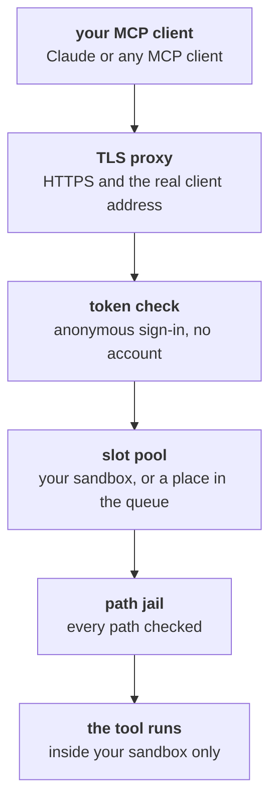
*One tool call, from your client to your sandbox.*

### Components

```mermaid
flowchart LR
  r["<b>server-sandbox.js</b><br/>the sandbox server"]
  d0["<b>oauth.js</b><br/>anonymous OAuth 2.1 sign-in"]
  r --> d0
  d1["<b>slot pool</b><br/>500 pre-made ZFS sandboxes"]
  r --> d1
  d2["<b>waiting queue</b><br/>arrival order, live position"]
  r --> d2
  d3["<b>notify_email.py</b><br/>optional "ready" email"]
  r --> d3
  d4["<b>path jail</b><br/>confines every path"]
  r --> d4
  d5["<b>watchdog</b><br/>wipes idle sandboxes"]
  r --> d5
  d6(["<b>MCP SDK</b><br/>streamable HTTP transport"])
  r --> d6
  d7(["<b>Express</b><br/>HTTP server"])
  r --> d7
```
*Sandbox server components. Rounded: third-party software.*

### Anonymous sign-in

Hosted MCP clients such as claude.ai call from shared, rotating server addresses, so an IP address cannot tell users apart. The server therefore uses a standard OAuth 2.1 flow whose sign-in page has a single button, **Create my sandbox**: no account and no email.

- **Discovery:** the client finds the sign-in endpoints by itself (RFC 9728 and RFC 8414).
- **Registration:** the client registers itself automatically (RFC 7591).
- **Authorization:** one-time code with PKCE (S256), so an intercepted code is useless.
- **Tokens:** an access token lasts 1 hour; the refresh token lasts 30 days and is replaced on every use.
- **Storage:** clients and tokens are stored hashed. Codes and pending sign-ins live in memory only.
- Each token maps to a random sandbox key. That key, not the IP address, decides which sandbox you get.

### The slot pool

500 sandboxes are created in advance as separate ZFS datasets, so the server never needs administrator rights while it runs. Connecting and listing the tools never takes a slot; a slot is taken on your first tool call.

### The waiting queue

- When all 500 are in use, your tool call joins a queue in arrival order and tells you your position and an estimated wait.
- A freed slot goes straight to the front of the queue: the sandbox is created at once and a one-time note says it is ready.
- Optionally, the sign-in page asks for an email address for a single "your sandbox is ready" message. It is kept in memory only, never written to disk, and deleted once sent or after 24 hours. The server sends at most 60 such emails an hour.

### Cleanup

Every tool call refreshes the sandbox. A watchdog checks regularly, and a sandbox that has been idle for 10 minutes is emptied and its slot freed. Your login stays valid, so your next tool call simply gets a new, empty sandbox, with a short note saying so.

### Isolation

- **Path jail:** every path a tool receives is resolved against your sandbox and refused if it leads outside it.
- **Symlink check:** a link inside the sandbox, for example from a cloned repository, could point anywhere. The jail finds the deepest part of the path that exists, resolves where it really lives and refuses it if that is outside the sandbox. A link that cannot be resolved is refused too.
- **Per-call context:** each tool call runs with its own context naming your sandbox, your project map and your edit state, so tools can never mix up two users.

### Endpoints

- `POST /mcp`: the MCP endpoint.
- `GET /health`: pool status and queue length (it drives the live spot counter on these pages).
- `/.well-known/*`, `/register`, `/authorize`, `/token`: the sign-in flow.

<a id="mcp-sandbox"></a>
## Your private sandbox

*A private, temporary workspace: your files, your project map and your edit history, invisible to every other user.*

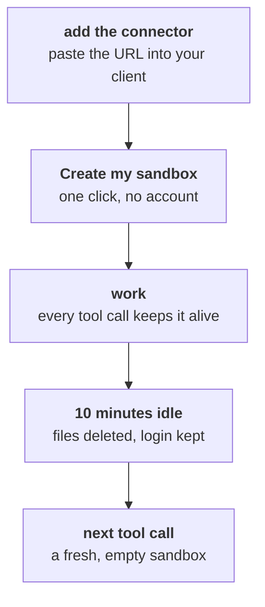
*A sandbox lives while you use it.*

### What is inside

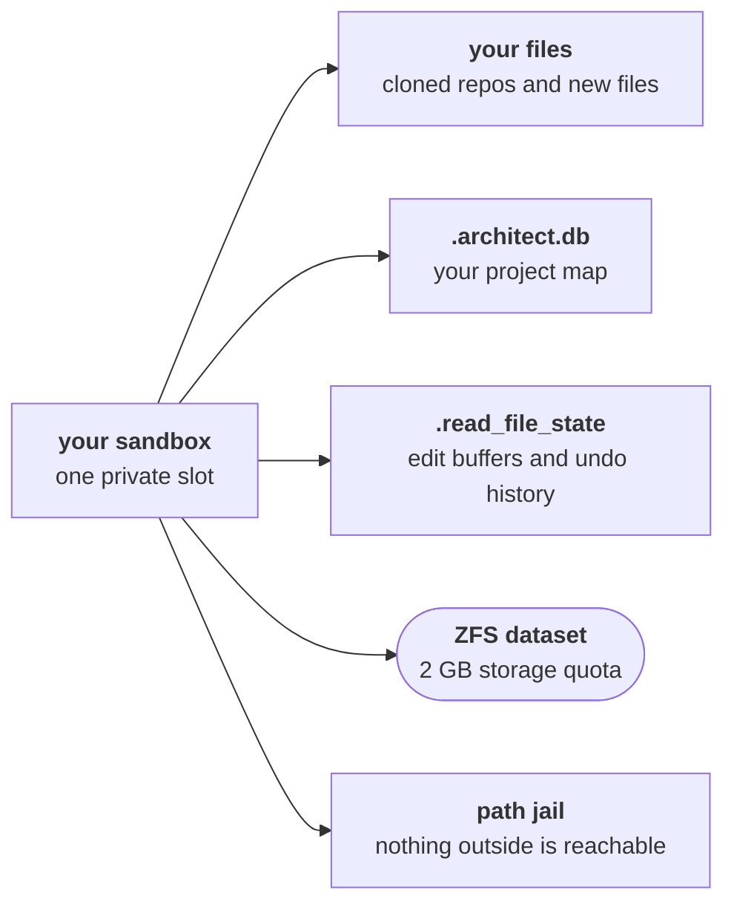
*What a sandbox holds. Rounded: provided by the host.*

- **Your files:** repositories you clone and files you create.
- **Your project map:** master_architect keeps its index of your code inside your sandbox, not in a shared database.
- **Your edit state:** read_file buffers, verification results and undo history live here too.
- **2 GB of storage:** each sandbox is its own ZFS dataset with its own quota.

### How long it lives

- It starts on your first tool call, not when you connect.
- Every tool call keeps it alive.
- After 10 minutes without activity, its files, project map and edit history are deleted.
- Your login stays valid for up to 30 days, so the next tool call gets a fresh, empty sandbox without signing in again.

### What it cannot reach

- Anything outside the sandbox folder, including through symlinks.
- Private networks and this machine's own services: web_skeleton reaches public internet addresses only.
- Remote repositories for writing: git has no push.

> **This is a demonstration service.** Don't put anything sensitive or confidential in the sandbox. It is built for trying the tools, not for private data.

### Why temporary

A sandbox that empties itself needs no account, no storage plan and no cleanup policy, and it keeps 500 spots available for everyone who wants to try the tools.

<a id="mcp-tool-master-architect"></a>
## master_architect

*The project map. It indexes a codebase once and lets the agent see files, functions and how they connect, before reading a single line.*

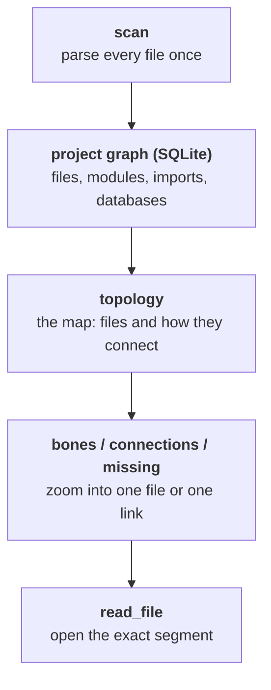
*master_architect turns a project into a map the agent can query.*

### Components

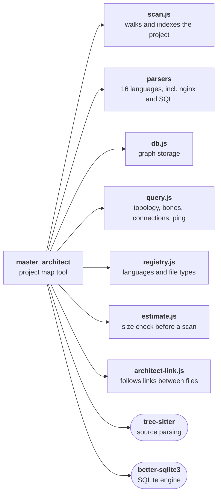
*master_architect components. Rounded: third-party software.*

### How it works

master_architect scans a project and stores it as a graph in SQLite: every file, module, function and import, plus the databases, programs and servers the code refers to. Each item gets a hierarchical address such as `13.2.4`: file 13, module 2, method 4. Files it cannot parse still get an address (with letters), so they can be linked to.

### Capabilities

- **topology:** the starting point. The project's files and how they import each other, plus databases and external programs.
- **bones:** one file's structure: its imports and its functions, with addresses.
- **navigate:** open a file, module or method by its address.
- **connections:** follow the links into and out of a file.
- **ping:** traces where a file leads, hop by hop through its imports (see below).
- **context:** a cross-reference summary for a file, by its path.
- **missing:** imports that point at nothing, found before anything runs.
- **estimate** and **scan:** check a project's size, then index it.
- **crawl:** follow links outward from a file to discover related files.
- **languages** and **stats:** supported languages and index statistics.

### Tracing: where does a file lead?

`ping` works like a network trace-route, over the import graph. Starting from one file, it follows every internal import hop by hop, numbering the hops, until each branch ends. Each route is labelled by how it ends:

- **external:** an import of an outside library.
- **blocked:** an internal import that resolves to nothing: a broken link.
- **cycle:** an import of a file the trace has already reached.
- **leaf:** a file that imports nothing.
- **endpoint:** a server, program, model or port the code refers to.

Routes come back longest first, the best place to start looking for a bug that surfaces far from its cause. The walk stops after 25 hops unless told otherwise. Tracing is per file today; tracing individual function calls is planned.

### Why it is built this way

- **SQLite** keeps the graph self-contained: no database server, and it handles graphs with hundreds of thousands of items.
- **Hierarchical addresses** are short enough to pass between tool calls and stay valid when lines move.
- **Import resolution follows real project layouts:** packages, plain sibling imports in script folders, and `src/` layouts. An import rooted in the project that resolves to nothing is reported as broken, instead of being mistaken for an external library.

### In the sandbox

Scanning is limited to your sandbox, and your project map is stored inside it, so it disappears with the sandbox.

<a id="mcp-tool-read-file"></a>
## read_file

*The segment editor. It shows a file as named parts, lets the agent change exactly one of them and refuses to save anything that does not pass verification.*

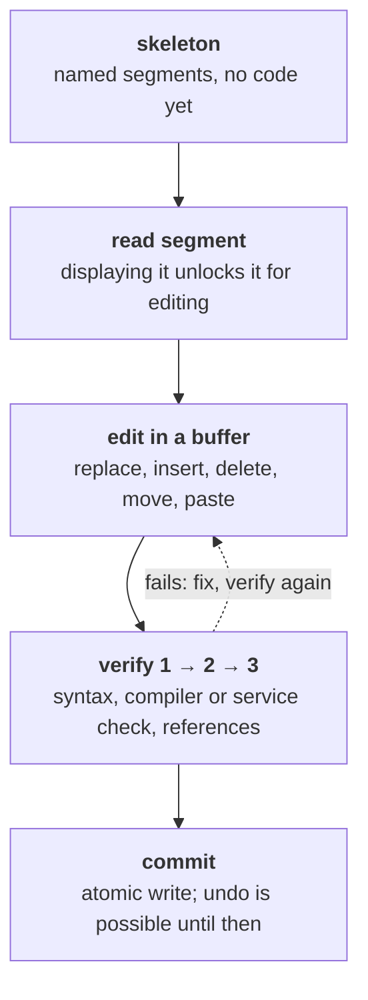
*read_file: nothing reaches disk until it passes verification.*

### Components

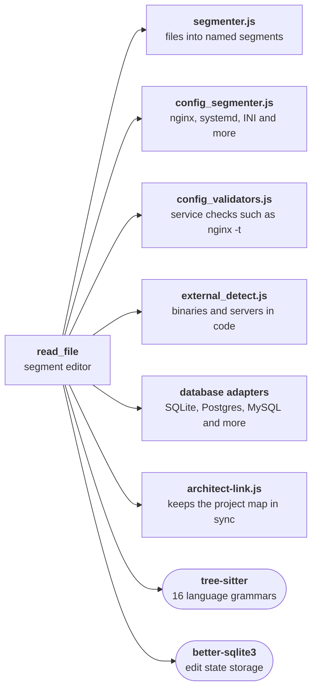
*read_file components. Rounded: third-party software.*

### How it works

read_file parses a file into named segments: functions, classes, configuration blocks, paragraphs. By default it returns the skeleton, the list of segments with their names and sizes, not the code. The agent reads only the segment it needs. Every byte of the file belongs to exactly one segment, including blank lines, so joining the segments always gives back the original file.

### Capabilities

#### Reading

- **skeleton:** the default view; `full_skeleton` forces the whole map of a very large file.
- **search:** narrows a large skeleton to matching segments.
- **segment:** reads one part by address, such as `5.3`.
- **trace:** follows the file's signal through the codebase: what it imports, who imports it, and the databases, programs and servers it touches. It then checks the direct neighbours: any that has not been verified gets a level 3 check, and the walk stops at the first failure.
- **status:** lists open edit buffers.

#### Editing

- **replace**, **insert** between two segments, **delete**, **move**.
- **comment_out** and **uncomment** a segment while debugging.
- **paste:** copy a segment, or a whole file, verbatim from the read buffer into the file being edited (see the clipboard below).

#### Two buffers and the clipboard

read_file keeps exactly two buffers per sandbox. The read buffer is read-only and always fresh, and doubles as a clipboard: open any file there, then paste one of its segments, or the whole file, verbatim into a segment of the file you are editing. The model never retypes code it copies, so nothing is lost or changed on the way, and it costs almost no tokens. The edit buffer holds the one file being changed; it is committed or discarded before another file is opened for editing.

#### Undo

- Every edit records its inverse: the previous text, a deleted segment with its position and children, or where a moved segment used to be. The record is also written to the edit history database.
- **undo** reverts the last edit.
- **undo** with an address reverts the latest change to that one segment, even when other edits came after it.
- **undo all** reverts every edit since the last commit.
- Inserts, deletes and moves change the structure of the file, so they are undone in reverse order (last in, first out). Text replacements can be undone in any order.
- Every undo clears the verification: the file must pass verify again before it can be committed.

#### Safety

- **Read before write:** a segment must have been displayed since the last change before it can be changed.
- **verify:** level 1 syntax; level 2 the language's compiler or the service's own checker, such as `nginx -t`, `systemd-analyze verify` or `sshd -t`; level 3 imports and external references must resolve.
- **diff** shows changes against disk; **discard** drops the edit buffer.
- **commit:** an atomic write, only with a current verification. It writes through symlinks to the real file and keeps its permissions.

#### Languages

16 tree-sitter grammars: Python, JavaScript, TypeScript, HTML, CSS, Go, Rust, C, C++, Java, C#, PHP, Ruby, Bash, Swift and Kotlin. Configuration files (nginx, systemd units, sshd_config, INI and more) get structure-aware segments, and plain text and Markdown are split into paragraphs.

### Why it is built this way

- **Segments instead of lines:** a function named `authenticate_user` stays addressable when it moves from line 214 to line 389.
- **Read before write** stops the most common agent mistake: editing code it never looked at.
- **Verify before commit** turns a broken edit into a clear error message instead of a broken file.
- In typical use the agent reads about 120 lines instead of a whole 5,000-line file.

<a id="mcp-tool-write-file"></a>
## write_file

*Creates new files, and only new files. Existing files are changed through read_file, with its safety rules.*

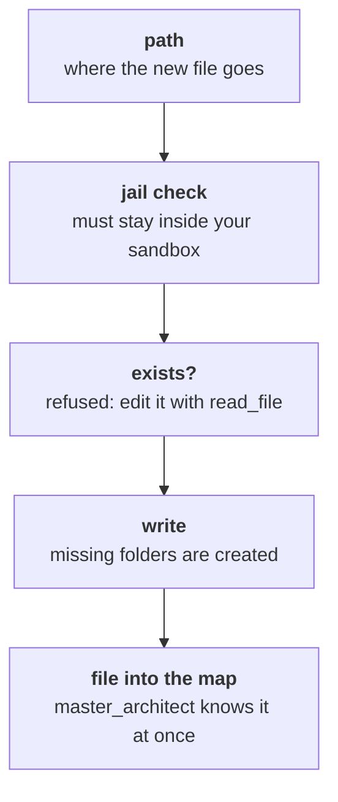
*write_file: new files only, filed into the project map.*

### Components

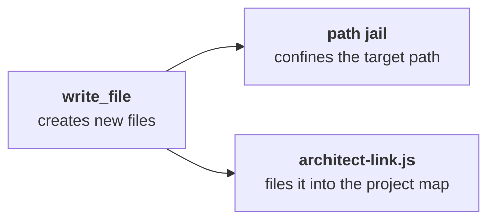
*write_file components.*

### Capabilities

- Creates a file at the given path, creating missing folders.
- Refuses to overwrite: if the file exists, it says so and points to read_file.
- Files the new file into the project map, so master_architect and read_file know it immediately.

### Why

Silent overwrites are one of the most common ways agents destroy work. Making creating and editing two separate tools removes that ambiguity entirely.

<a id="mcp-tool-git"></a>
## git

*Gets code into the sandbox and records your work there. Nothing leaves: there is no push.*

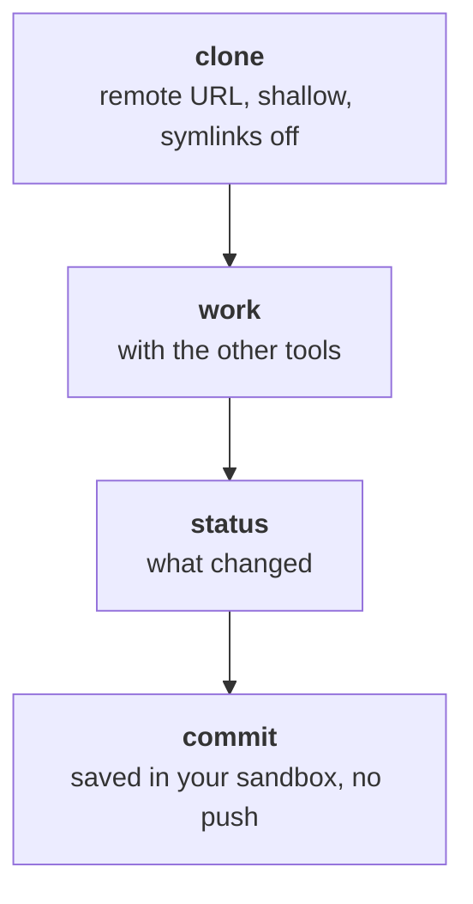
*git: code comes in, nothing goes out.*

### Components

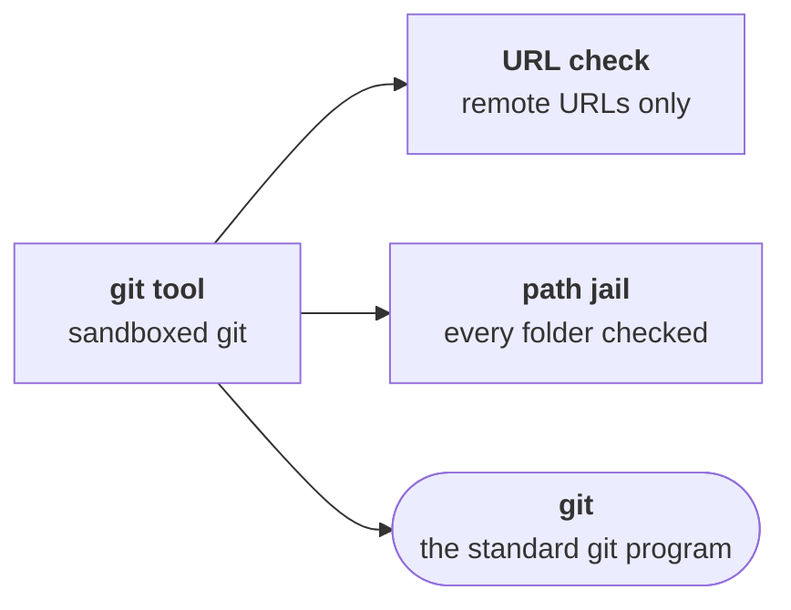
*git components. Rounded: third-party software.*

### Capabilities

- **clone:** remote URLs only (https, http, git, ssh or `user@host:path`), never a local path. Shallow (`--depth=1`), with a 2-minute limit. Into the sandbox root unless you name a folder.
- **status:** the changed files in a cloned repository.
- **commit:** saves your changes in the sandbox under a fixed sandbox identity.

### Safety

- Every folder is checked against the sandbox, including where symlinks really lead.
- Clones are made with symlinks turned off, so a repository cannot plant a link that points outside the sandbox.
- No push, so the sandbox can never publish anything.

### Why

A shallow clone turns minutes into seconds for large repositories, and most tasks need no history.

<a id="mcp-tool-web-skeleton"></a>
## web_skeleton

*Reads the web the way the other tools read code: a skeleton first, then only the section that matters.*

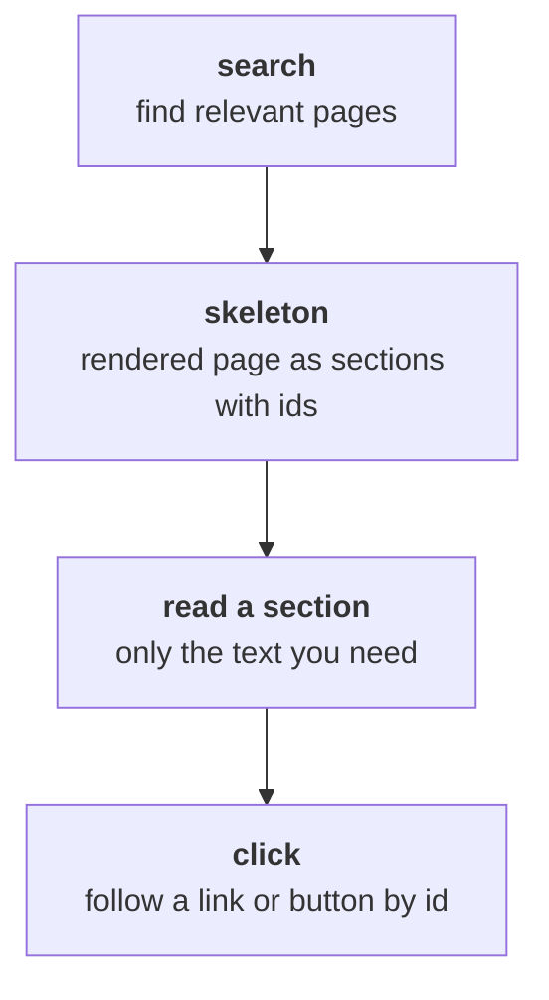
*web_skeleton: read the part of a page you need, not the whole page.*

### Components

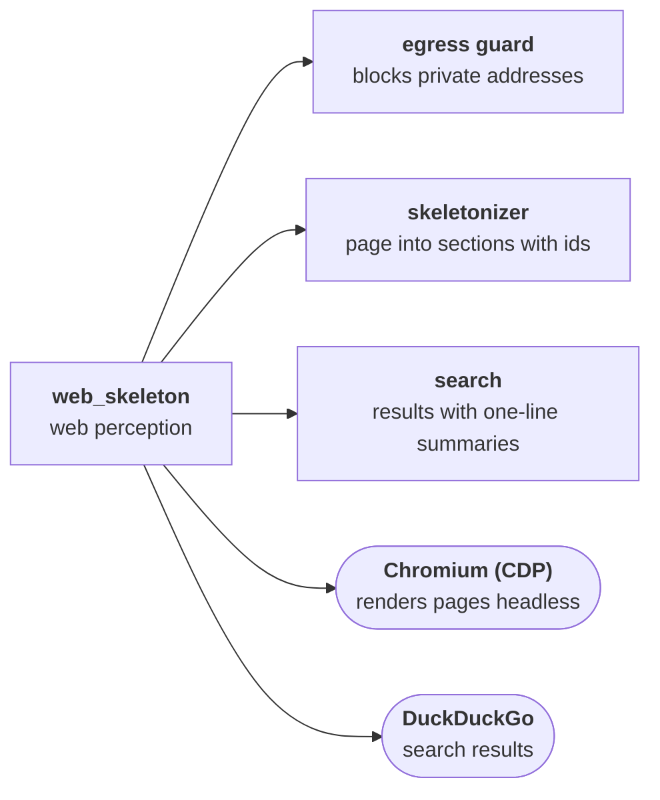
*web_skeleton components. Rounded: third-party software.*

### Capabilities

- **search:** search results, each with a title and a one-line summary.
- **skeleton:** a rendered page as headings, sections, links and form elements, each with a stable id.
- **read:** the full text of one section by id.
- **click:** follow a link or button by id and get the new page's skeleton.

### How it works

Pages are rendered in headless Chromium through the Chrome DevTools Protocol, so content built by JavaScript is included. In typical use, a page that would cost 50,000 to 200,000 tokens as raw HTML becomes a skeleton of 500 to 3,000 tokens.

### Safety in the sandbox

- **Egress guard:** all browser traffic, including redirects, frames, background scripts and websockets, goes through a guard that resolves every address itself.
- Private, loopback, link-local and cloud metadata addresses are refused, and the guard connects only to the exact address it checked, so DNS tricks cannot reach this machine or its network.
- Only https for public sites; `file://`, `data:` and similar schemes are blocked.

<a id="try-it"></a>
## Try it

Add this URL as a custom connector in your MCP client:

```
https://mcp.itamos-technologia.com/mcp
```

1. Add the URL as a connector in your MCP client.
2. A page opens: choose **Create my sandbox**. No account needed.
3. Ask your agent to clone a repository and explore it with the tools.

---

*This file is generated by `docs/build_paper.py`; edit the content there.*
